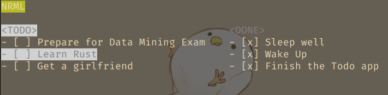

# Togo

Simple Interactive Terminal Todo App in Go.



## Quick Start

```console
$ go mod tidy
$ go run main.go
```

## Controls

|Keys|Description|
|---|---|
|<kbd>ARROW_UP</kbd>, <kbd>ARROW_DOWN</kbd>|Move cursor up and down|
|<kbd>k</kbd>, <kbd>j</kbd>|Drag the current item up and down|
|<kbd>r</kbd>|Rename the current item|
|<kbd>a</kbd>|Insert a new item|
|<kbd>d</kbd>|Delete the current list item|
|<kbd>q</kbd>, <kbd>Esc</kbd>|Quit|
|<kbd>TAB</kbd>|Switch between the TODO and DONE panels|
|<kbd>Enter</kbd>|Perform an action on the highlighted UI element | confirm Input|
